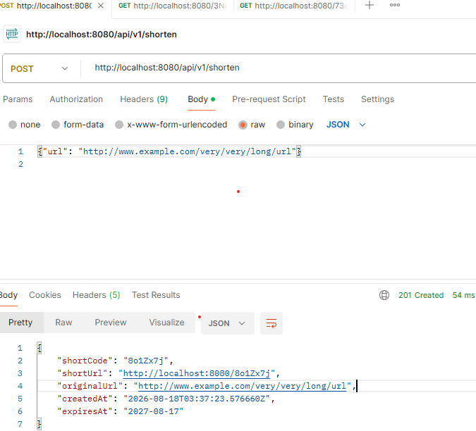
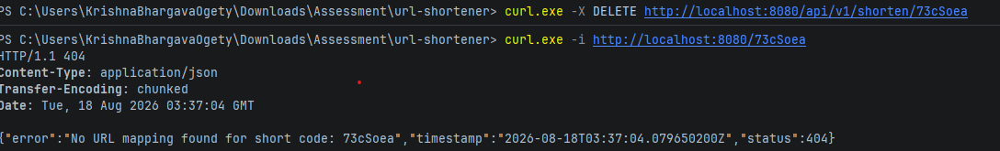
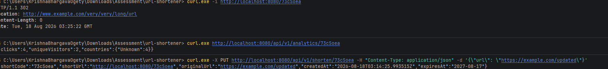

# Testing Strategy

## What's covered

**Service layer (`UrlShortenerServiceImplTest`, Mockito)** — repository and
`RedisCacheClient` are mocked, so these run in milliseconds with no infra.
Covers: create (code generation, persistence, cache population), duplicate
URL short-circuit, custom alias skips dedup and rejects a taken alias,
cache hit vs. cache miss on resolve, not-found, expired link, update
(URL and/or expiry), delete removes both DB row and cache entry.

**Analytics (`AnalyticsControllerTest`)** — verifies the response shape
(`clicks`, `uniqueVisitors`, `countries`) and the not-found path.

**Controllers (`UrlControllerTest`, `RedirectControllerTest`,
`@WebMvcTest` + MockMvc)** — service layer mocked; tests HTTP concerns:
status codes, validation rejection, the 302's `Location` header, that a
redirect fires the async analytics call with the resolved country and does
*not* fire it on a 404, that update/delete map service exceptions to the
right status through the global exception handler.

**Util (`Base62EncoderTest`, `UrlHasherTest`, `VisitorHasherTest`)** —
determinism and collision-sensitivity of the encoding/hashing functions in
isolation from the services that use them.

## What's deliberately not covered here

- **No integration test against real Postgres/Redis.** Unit + slice tests
  give fast, deterministic coverage of the branches that matter (cache
  hit/miss, expiry, dedup, conflicts). A Testcontainers-backed integration
  test — verifying the Flyway migration actually matches the JPA mapping,
  and that the rate limiter's Redis keys behave correctly under real
  concurrent connections — is the next thing before calling this
  production-ready in the fullest sense.
- **No load/concurrency test** on the short-code collision retry or the
  rate limiter, despite both being exactly the kind of logic that looks
  fine in a unit test and breaks under real concurrent load.
- **No test asserts the async analytics write actually lands** (only that
  it's *called*) — asserting the DB row exists after an `@Async` call
  requires either `Awaitility`-style polling or making the executor
  synchronous in a test profile; left out for this scope and noted here
  rather than silently skipped.

## Running

##Postman Screen shot 

```
## curl 


